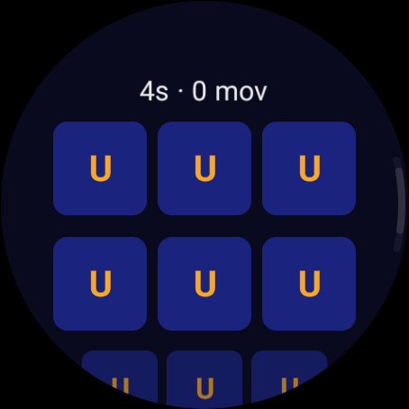
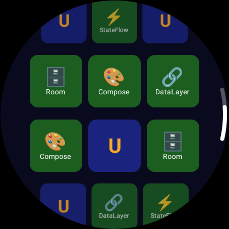

# Memory Match Wear OS

Juego de memoria para Wear OS con conceptos de Android.

## 🎮 Sobre el Juego

Memory Match es un juego de memoria que muestra una cuadrícula de 12 tarjetas (6 pares) en la pantalla circular del reloj. El jugador debe encontrar los pares de componentes Android.

### Pares de tarjetas:
- ⚡ StateFlow
- 🏛 ViewModel
- 🗄 Room
- 🔄 Flow
- 🎨 Compose
- 🔗 DataLayer

## 📱 Capturas de pantalla

## 🎯 Características

- ✅ Animación 3D flip
- ✅ Vibración háptica
- ✅ Temporizador
- ✅ Mejor tiempo guardado
- ✅ Pantalla de victoria con reinicio
- ✅ Adaptado para pantallas circulares

## 🛠️ Tecnologías

- Kotlin
- Jetpack Compose for Wear OS
- Coroutines & Flow
- StateFlow
- ViewModel
- DataStore
- Clean Architecture

## 🚀 Ejecutar

1. Abrir en Android Studio
2. Seleccionar dispositivo Wear OS
3. Ejecutar

## 📱 Requisitos

- Wear OS API 30+
- Android Studio Hedgehog+

## 📄 Licencia

MIT